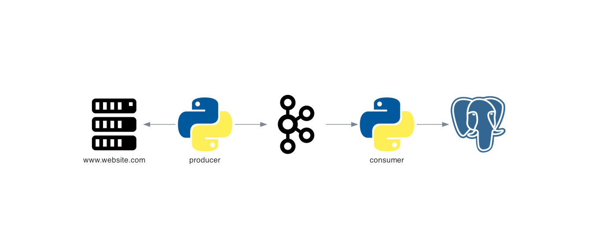

# site_checker

## Overview

`site_checker` monitors website availability over the
network, produces metrics about this and passes these events through `Kafka` instance into `PostgreSQL` database.
`site_checker` is divided in two components:

- **producer:** collect website metrics and publish results to `Kafka`
- **consumer:** consume metrics from `Kafka` topics and save metrics into an `PostgreSQL` database.

## Contribute
For more detail, please check [CONTRIBUTING.md](CONTRIBUTING.md) guide.
