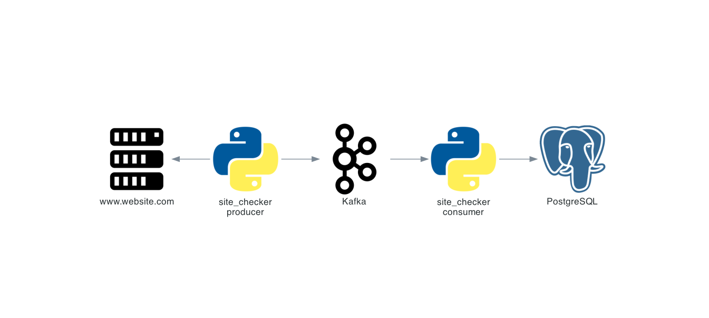

# site_checker

[](https://github.com/ambv/black/)
[](http://mypy-lang.org/)

## Overview

`site_checker` monitors website availability over the
network, produces metrics about this and passes these events through `Kafka` instance into `PostgreSQL` database.
`site_checker` is divided into two components:

- **producer:** collect website metrics and publish results to `Kafka`
- **consumer:** consume metrics from `Kafka` topics and save metrics into a `PostgreSQL` database.



## Demo

[](https://asciinema.org/a/3zKRgfBovD0qMehdVwWBuf0ao)

## Getting Started

This section will guide you through the steps to reproduce locally the demo presented above.

This tutorial expects you have already a `Kafka` and `Postgres` instance running. For more details please check, [How to set up managed Apache Kafka](https://www.youtube.com/watch?v=YH-S3Huwfms) and [How to deploy an open source database](https://www.youtube.com/watch?v=t95IQ0kpbFY).

Last request before start 🙏, On the Aiven Kafka dashboard, please go to  **Overview tab** to the **Advanced configuration** section and enable the `kafka.auto_create_topics_enable` parameter which will allow you to produce messages to Kafka without needing to create a topic beforehand.

1. Checkout this repository:

```sh
$ git clone git@github.com:aiven-recruitment/site_checker.git
$ cd site_checker
```

2. Setup credentials

```sh
$ vim example/example.consumer.env # replace <CHANGEME> entries
$ vim example/example.producer.env # replace <CHANGEME> entries
# Copy the Kafka and Postgres SSL certificates to example/ folder
$  cp ~/Downloads/ca.pem example/
$  cp ~/Downloads/service.* example/
```

3. Start docker-compose

```sh
$ make run
```

4. Check application logs.

```sh
$ make logs
```

5. Check the data saved into `Postgres`.

 ```sql
$ psql -U <USER> -h <HOSTNAME> -p <PORT> defaultdb
$ select * from site_checker.apache;
 ```

6. Clean

```sh
$ make clean
```

## Production deployment

### Configuration approaches

- `config.ini`, can check multiple websites, for more details please check the [example/example.
- docker `.env` or `CLI parameters`, checks a single website, for more details please check the [example/example.producer.env](example/example.producer.env) file.

### Scalability considerations

- The `config.ini` configuration approach will create one `thread` per website. In case you want to run `site_checker` in a single host to check multiple websites the performance will be limited by the host resources, too many websites or threads can cause too many switch context operations leading to performance impacts.
config.ini](example/example.config.ini) file.


- The `CLI parameters` configuration approach also used in the `Demo`, will create a single python `process`. In case you want to monitor more than one website using this approach, you can build a container using the [Dockerfile](Dockerfile) definition as an starting point, and launch it in your container orchestrator system, e.g: `Kubernetes`, `AWS ECS` or `Mesos`.


### Security considerations

The `site_checker` `consumer` will create automatically one table per topic, for example, topic name `apache` creates the table name `apache` under the schema `site_checker` into the `Postgres` instance. The `Demo` and `Getting Started` are using admin credentials to keep the steps simpler. However, this approach is not suitable for production workloads.

For production it is recommended to create an application user limiting the usage only to the `site_checker` schema.
Example:

```sql
CREATE USER site_checker WITH PASSWORD '<STRONGPASSWORD>';
GRANT USAGE ON SCHEMA site_checker TO site_checker;
GRANT CREATE ON SCHEMA site_checker TO site_checker;
GRANT INSERT ON ALL TABLES IN SCHEMA site_checker TO site_checker;
```

## Contribute
For more detail, please check [CONTRIBUTING.md](CONTRIBUTING.md) guide.
